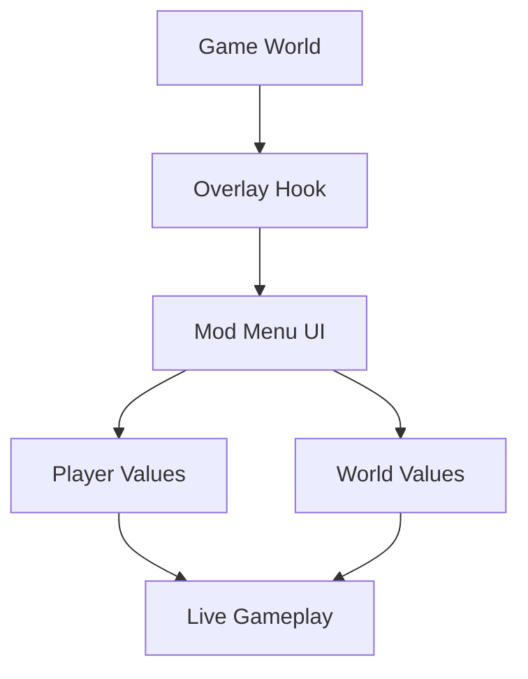

# Enshrouded Mod Menu — Shape the Fog, Rewrite the Journey

In **Enshrouded**, the world breathes through mist. Ruins whisper. The Shroud presses in like a memory you can’t quite shake. Survival here is not loud heroism—it is patience, preparation, and quiet mastery.

This **Enshrouded Mod Menu** is built for those who want to *understand* the land before it devours them. Not to rush past the danger, but to bend it gently, testing limits, exploring freely, and building without constraint.

---

## 🌲 Overview — What the Mod Menu Unlocks

This is not a single-purpose cheat.
It is a **sandbox of control**.

The mod menu runs as an external tool with an in-game overlay, offering real-time toggles for survival mechanics, combat values, and world interaction. You decide how close to the edge you want to walk.

Core philosophy:

* Modular features (use one or all)
* Instant enable / disable
* Designed for solo & cooperative PvE
* Minimal performance impact
* Clean, readable interface

The fog still rolls in—but now, you choose how it feels.

---

## 🛡 Survival & Player State Controls

The land is harsh. Sometimes, you need room to breathe.

### ❤️ Core Survival Options

* God Mode (full invulnerability toggle)
* Infinite health & stamina
* Hunger & thirst freeze
* No poison / no Shroud damage
* Temperature resistance (cold & heat)

Perfect for exploration deep into corrupted zones or learning dangerous areas without constant resets.

> [!IMPORTANT]
> Survival options can be bound to hotkeys, allowing quick toggles when switching between exploration and combat.

---

## ⚔️ Combat & Ability Tweaks

Combat in Enshrouded is deliberate and weighty. The mod menu enhances flow without turning fights into chaos.

### 🎯 Combat Modules

* Damage multiplier (melee, ranged, magic)
* One-hit kill (optional, testing-focused)
* No skill cooldowns
* Infinite mana
* Cast speed adjustment

You can dial power up—or down—until combat feels exactly right for your build experiments.

---

## 🧱 Crafting, Building & Resource Freedom

This is where the menu truly sings.

### 🛠 Craft & Build Enhancements

* Free crafting (no material cost)
* Instant crafting & smelting
* Infinite durability (tools & gear)
* Unlock all recipes
* Building placement without restrictions

Build not just faster—but *bolder*. Towers in impossible places. Bases shaped by imagination, not grind.

---

## 🧭 Movement, Camera & Exploration Tools

Sometimes survival means simply *seeing more*.

### 🌬 Exploration Features

* Movement speed multiplier
* No fall damage
* Fly / free-move mode
* Free camera (perfect for screenshots)
* Fog density control (visual only)

Walk above the ruins. Drift through the Shroud. Learn the map like a storyteller, not a victim.

---

## ⚙️ Interface & Customization

The mod menu interface is intentionally calm:

* Toggle-based layout
* Real-time sliders
* Category tabs (Survival / Combat / Build / World)
* Fully rebindable hotkeys
* Save & load custom profiles

No visual clutter.
No cryptic labels.
Just quiet authority.

---

## ⚡ Setup — As Gentle as the Fog

Installation avoids drama:

1. Launch Enshrouded
2. Load into your world
3. Run the mod menu as administrator
4. Press `Insert` to open the overlay
5. Enable only what you need

Close the menu, and everything returns to normal—no permanent changes, no traces left behind.

---

## 🔁 How the Mod Menu Works

A simple loop.
When you step away, the world exhales.

---

## ❓ FAQ — From Wanderers Like You

**Is this a trainer or a mod menu?**
A mod menu: multiple systems, real-time toggles, and broader world control.

**Can I use it in co-op?**
Yes, in PvE co-op sessions, though effects may be client-side only.

**Does it break saves?**
No. Changes are temporary and memory-based.

**Can I build freely, then disable it?**
Absolutely. Your creations remain.

**Will updates require reinstalling?**
Usually not—minor updates are handled seamlessly.

---

## 🌫 Final Thoughts

Enshrouded is a world of pressure and poetry.
This mod menu doesn’t erase the danger—it gives you space to *listen*.

To learn.
To build.
To wander farther than fear would normally allow.

The fog still surrounds you.
But now, it answers when you speak.

---
